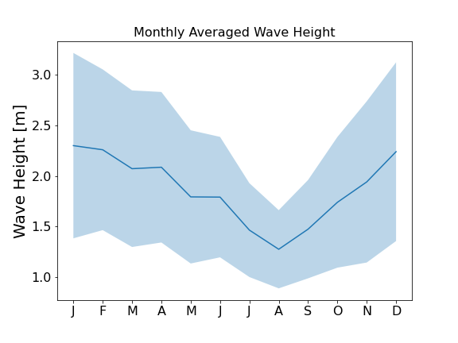
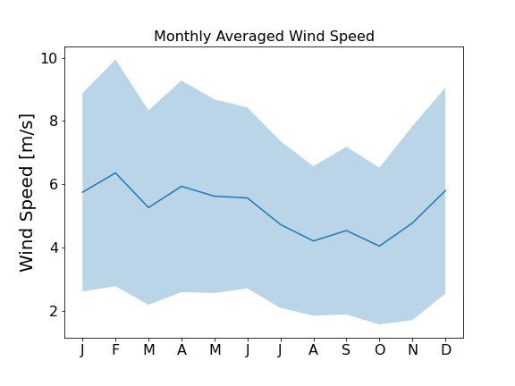
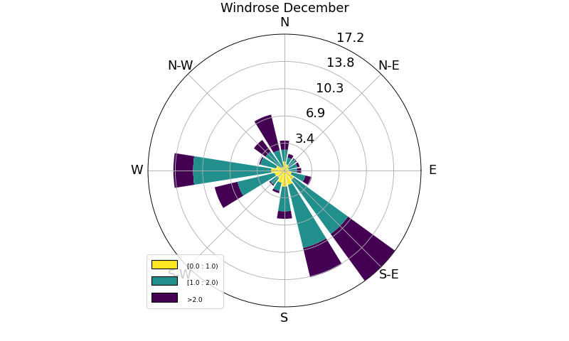
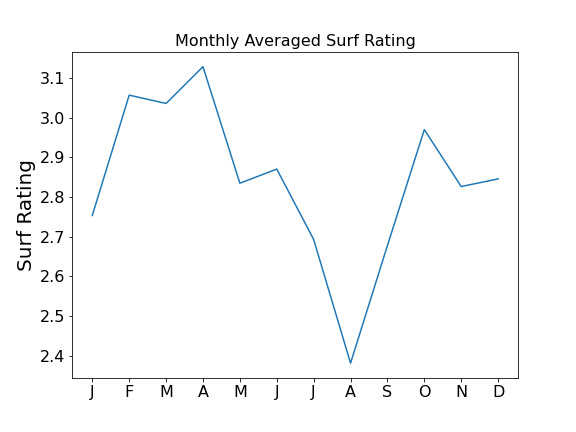
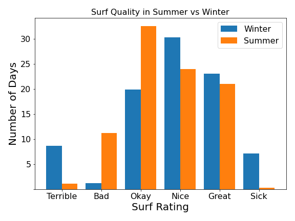
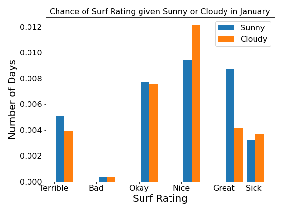
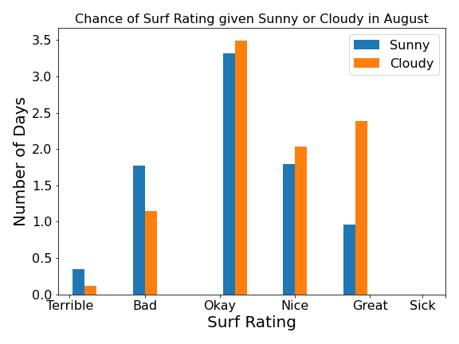

# SurfMyths-vs-Data
In this project, I verify or debunk some surf myths and conceptions. I have only started surfing recently, therefore, to compensate for my lack of experience I use data. To be precise, I use wind, wave and weather data to derive features such as Wave Rating, Surf Rating, Sunny Weather.

## Questions:
**1. Is the surf better in winter than in summer?**

*Yes, indeed. Waves are statistically bigger in winter and the wind is more favourable. So go surfing in winter even though its cold*

**2. Is the surf better when its sunny**

*No. Actually, sunny or cloudy does not impact the surf much. Interestingly, there is a higher chance of good surf when it's raining, because there are more cloudy days in winter (for the US west coast). So don't let bad weather discourage you to go surfing.*

**Summary:** I can use the knowledge gained from this data analysis to motivate myself to go surfing on cold and cloudy winter days.

*Tools used: Python, matplotlib, pandas, numpy, web scrapping* 

## Detailed description of the Project
### Motivation
Most people (in Australia) started surfing when they were young and have years of experience. I only started in my late 20s. To make up for the lack of experience, I use my data analysis skills to learn more about the ocean and make smarter decisions about when to go surfing. In the following, I will summarise the project, but all the details and code can be found in the notebook.

### Data collection
The most cumbersome part of this project was to get the data. To my surprise, the wave data was very easy to come by compared to the weather data. I guess you can't make much money off wave data. It was really difficult to get my hands on weather data. At least for Australia, all the weather data is locked behind the Bureau of Meteorology. That's why I opted for the US. NASA offers free weather data.

### Feature Engineering
To answer the questions, I combined information about wind strength, wind direction and wave size that rates the surf quality from 0-5 for every day.

The free weather data from NASA provided lots of information, but not the simple classification of whether it was a sunny day or not. Instead, this feature had to be created from the average radiation. Cloud coverage reduces the received radiation, thus, leading to a lower daily average radiation. In this way, we could identify sunny days as days where the average radiation is the largest

### Results
**Seasonal Trends**:

Winter performs better in both wave size (bigger) and wind speed (smaller)

 

Also, the wind directions are more favourable. We want the winds to blow offshore and our example San Francisco faces ESE. 

**Surf Rating**

We combined wind speed, wind direction and wave height into a new feature called Surf Rating, which rates the surf 0-5.

 

**Sunny vs. Cloudy**

From my perception, it always felt like the surf conditions are better on sunny days than on cloudy days. But it turns out this is not exactly true. To prove this, I compared the chance of each surf rating given its sunny or cloudy for a summer and a winter month. In summer, the surf is better on cloudy days and in winter on sunny days.

 

### Conclusions
The data support the common conception that the waves are bigger in winter. That is because more storm systems forming out in the ocean bringing along bigger waves. Furthermore, there are more days with favourable winds. My feeling that the surf is usually better on sunny days seemed to be a misconception unless the weather conditions are very different from the Australian East Coast to the American West Coast. Overall, this project has shown me that I should go out more often on cloudy days and cold winter days.

